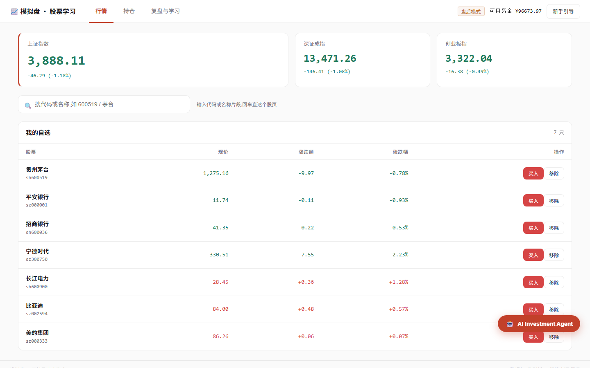
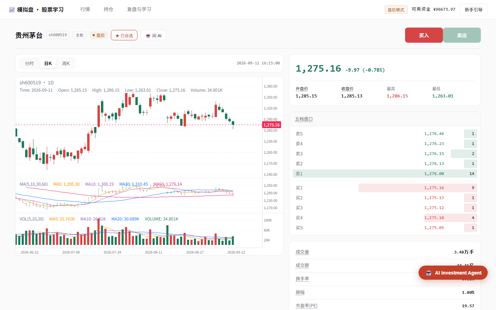
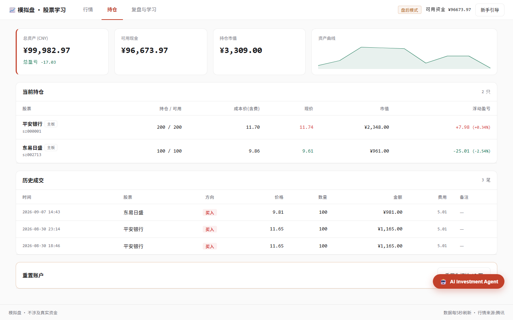
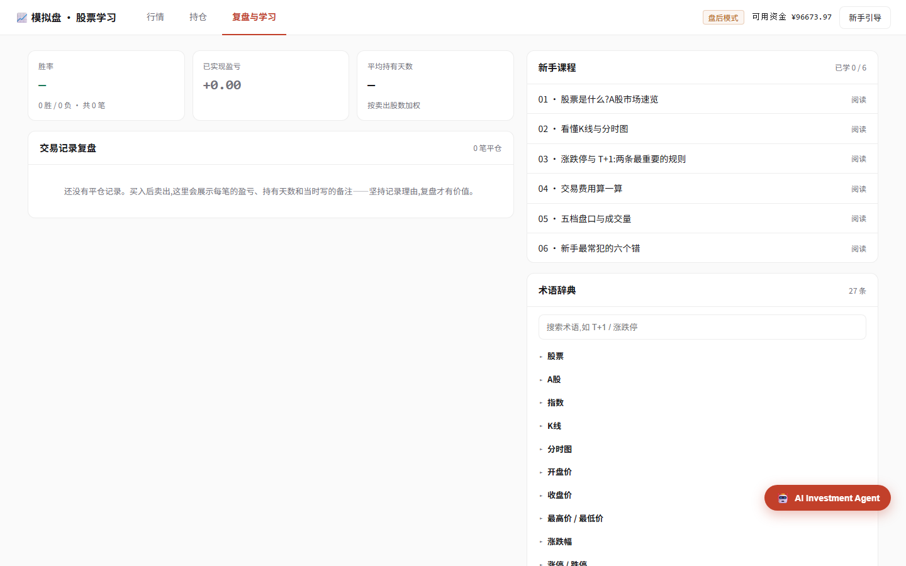
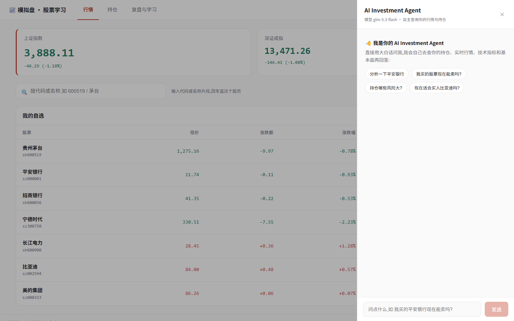
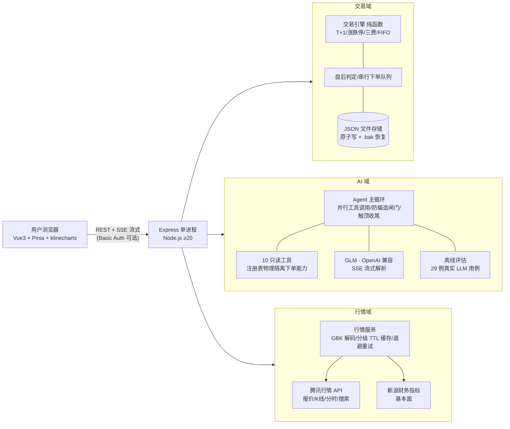

# 模拟盘 · 股票学习(A 股模拟交易 + AI Investment Agent)

给股票零基础用户的 A 股模拟炒股学习应用:**真实行情**、**完整 A 股交易规则**、**内置自然语言 AI Agent**——用大白话问"我买的平安银行现在能卖吗",它会自主查询你的持仓、实时行情、技术指标和财务基本面,再给出带数据来源的综合分析。零本金风险,配套术语卡、复盘统计与新手课程。

> 状态:v1 + AI Agent + 离线评估体系已交付 · 141 项单测全绿 · Agent 端到端评估(Intent 100% / 幻觉风险 0%,[评估报告](docs/evaluation.md))

## 界面预览

| 行情首页 | 个股详情 |
|---|---|
|  |  |

| 持仓资产 | 复盘学习 |
|---|---|
|  |  |

| AI Investment Agent(右下角随时唤起) |
|---|
|  |

## 功能一览

- **行情首页**:三大指数、自选股 5 秒实时刷新、代码/名称/拼音搜索(回车直达)
- **个股详情**:分时/日K/周K(klinecharts)、五档盘口、全部指标可点出术语卡
- **模拟交易**:完整 A 股规则(T+1、涨跌停、佣金/印花税/过户费、按手申报),下单前费用实时预览,拒绝原因说人话
- **持仓资产**:含费成本、浮动盈亏、资产曲线、历史成交、一键重置
- **复盘学习**:胜率统计、交易理由回看、6 篇新手课程、27 条术语词典、分步新手引导
- **AI Investment Agent(可选)**:10 只读工具自主规划调用链(实体解析 → 持仓/行情 → 技术指标 → 财务基本面),结构化分析卡 + 思考过程 SSE 流式可视;只分析、不代客交易

## 架构



数据细节与决策记录见 [docs/architecture.md](docs/architecture.md);Agent 评估体系与基线数据见 [docs/evaluation.md](docs/evaluation.md)。

## 快速开始

**方式一(Windows,推荐)**:双击 `启动.bat`——首次自动安装依赖并构建页面,之后秒开;浏览器自动打开 http://localhost:8090,关闭黑窗口即退出。

**方式二(通用 npm)**:

```bash
npm run setup    # 安装 server + web 依赖
npm run build    # 构建前端
npm start        # 启动,http://localhost:8090
```

要求 [Node.js](https://nodejs.org/) ≥ 20。开发模式:`npm run dev:server` + `npm run dev:web`(热更新)。

**常见问题**

- `Port 8090 is already in use`:已有一个实例在跑,关掉旧窗口再启动(或 `PORT=8091 npm start` 换端口)
- 行情区橙色横幅"行情获取失败":免费行情接口偶发波动,页面自动重试并保留旧数据
- 盘后/周末使用:界面有"盘后模式"角标,买卖按最近收盘价撮合;周末买入的股票要到下一交易日才能卖(T+1)

## 启用 AI Investment Agent(可选)

1. 到 [bigmodel.cn](https://bigmodel.cn) 注册并创建 API Key(有免费额度)
2. 创建文件 `C:\Users\<你>\.stock-learning\ai.json`(路径以页面提示为准):
   ```json
   { "apiKey": "你的Key", "model": "glm-5.3-flash" }
   ```
   保存后重启服务。默认 `glm-5.3-flash`(GLM-5 系,能力强、价格约为旗舰 1/10);想换只改 model 字段:免费用 `glm-4.7-flash`,最强用 `glm-5.3`。

Key 只存在本机,不进项目仓库。AI 只做分析参考、不能替你下单;输出仅供学习,不构成投资建议。

## 测试与评估

```bash
npm test        # 141 项单元测试(vitest):交易引擎纯函数 / Agent 编排逻辑 / SSE 解析 / 评分函数
npm run eval    # Agent 离线评估(真实 LLM 端到端,约 30-40 分钟)
```

最近一次评估基线(2026-09-10,glm-5.3-flash,29 例/31 轮):Intent 识别 100%、实体解析 96.6%、工具选择 89.7%、幻觉风险(未查先答)0%、无效工具调用 0%。完整指标、口径与行为解读见 [docs/evaluation.md](docs/evaluation.md)。

## 服务器部署(Docker)

打包成 Docker 镜像部署到云服务器,公网访问 + 口令保护(Basic Auth)+ 数据卷持久化:

```bash
cp .env.example .env   # 填网页口令与 AI 密钥
docker compose up -d --build
```

完整步骤、镜像离线搬运、HTTPS 建议与故障排查见 [docs/deploy.md](docs/deploy.md)。

## 文档导航

| 文档 | 用途 |
|---|---|
| [docs/requirements.md](docs/requirements.md) | 需求与功能规格 |
| [docs/architecture.md](docs/architecture.md) | 技术架构、数据模型、决策记录 |
| [docs/evaluation.md](docs/evaluation.md) | **Agent 离线评估体系与基线数据** |
| [docs/project-state.md](docs/project-state.md) | 项目进度与交接状态 |
| [docs/deploy.md](docs/deploy.md) | Docker 部署指南 |
| [AGENTS.md](AGENTS.md) | AI 协作约定(代理会话自动加载) |
| [docs/superpowers/](docs/superpowers/) | 设计过程原始稿(历史存档) |

## 技术栈

Node.js (Express) · Vue 3 (Vite, Pinia) · klinecharts · 本地 JSON 存储(原子写)
数据源:腾讯行情(实时报价/五档、K线、分时、搜索)+ 新浪财务指标(AI 基本面)

## 目录结构

```
股票学习/
├── server/          # 后端:行情服务、交易引擎(纯函数+单测)、AI Agent、离线评估(evals/)
├── web/             # 前端:五个页面(Vue 3)
├── content/         # 术语表、教程文章
├── data/            # 运行时账户数据(git 忽略)
├── design/stitch/   # UI 设计稿基准(5 屏)
└── docs/            # 文档体系(含截图 screenshots/)
```

## 设计基准

界面遵循 [docs/stitch/DESIGN.md](docs/stitch/DESIGN.md):红涨绿跌(A股惯例)、浅色主题、朱红主色(#C2402A)、等宽数字、中文界面。
